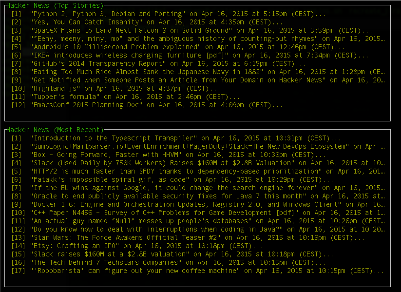

# Termui Widgets [](https://travis-ci.org/Matt3o12/termui-widgets) [](https://godoc.org/github.com/Matt3o12/termui-widgets) #

Termui provides additional widgets for termui that only fulfill one purpose. These widgets are not meant to be generic or multifunction. Configuration of these widgets is also very easy.

## Hacker News Widget ##


The Hacker News widget pulls the most recent or top stories from the official [Hacker News API](https://github.com/HackerNews/API). It does that asynchronously and updates its view.    
Implementing it is pretty straightforward:

```Go

	topStories := hackernews.NewWidget(hackernews.TopStories)
	topStories.Height = 15
	topStories.Width = 100
	draw := func() {
		ui.Render(topStories)
	}

	topStories.UpdateEntries(draw)
```

You will have to provide a callback which re-renders **all** `Bufferers`. Make sure the callback function is side-effect free because it gets called very often.  
You may choose to load the most recent stories by calling `hackernews.NewWidget(hackernews.MostRecent)`.